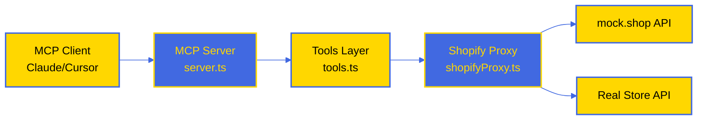
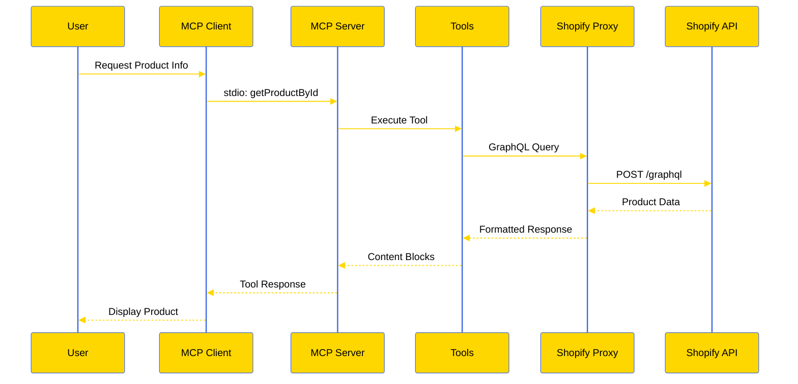

# Shopify MCP Proxy & Mock Server (ShopifyMCPMockShop)

This project implements a Model Context Protocol (MCP) server that acts as an intelligent bridge and proxy to Shopify's Storefront API. It uniquely supports `mock.shop` for safe development and testing without requiring real store credentials.

The server communicates via **Standard Input/Output (stdio)**, making it suitable for local integration with clients like Claude Desktop and Cursor.
## Motivation
 
Generic AI developer tools and off-the-shelf MCP servers often promise much but can lack the transparency, safety mechanisms (like explicit `ToolAnnotations`), stability, or specific features needed for controlled development and testing, especially against rapidly evolving APIs like Shopify's.
 
This project was born from the need for a reliable, open-source Shopify MCP server that:
 
*   **Prioritizes Safety:** Integrates deeply with `mock.shop` to provide a crucial sandbox for risk-free development and accurate testing without impacting live stores.
*   **Emphasizes Transparency & Control:** Allows developers (and their AI partners) to understand exactly how interactions with the Shopify API occur, including which API versions are used and the potential impact of actions (via `ToolAnnotations` like `readonly`, `destructive`, etc.).
*   **Addresses Specific Needs:** Fills the gap left by purely informational tools or closed-source commercial offerings by providing a *safe execution engine* tailored for Shopify development workflows.
 
The goal is to enable developers to confidently leverage AI assistance for Shopify tasks, knowing they have a tool built with intentional guardrails and clear operational context.

## Architecture

### System Overview


### Data Flow


### Tool Hierarchy

```mermaid
%%{init: {'theme':'dark', 'themeVariables': { 'primaryColor':'#FFD700', 'primaryTextColor':'#000', 'primaryBorderColor':'#4169E1', 'lineColor':'#4169E1', 'secondaryColor':'#4169E1', 'tertiaryColor':'#1E90FF', 'background':'#000000', 'mainBkg':'#FFD700', 'secondBkg':'#4169E1', 'tertiaryBkg':'#1E90FF', 'textColor':'#FFD700', 'labelBoxBkgColor':'#000000', 'labelBoxBorderColor':'#FFD700', 'labelTextColor':'#FFD700', 'actorBkg':'#FFD700', 'actorBorder':'#4169E1', 'actorTextColor':'#000', 'actorLineColor':'#4169E1', 'noteBkgColor':'#FFD700', 'noteTextColor':'#000', 'signalColor':'#FFD700', 'signalTextColor':'#000'}}}%%

graph TD
    API[Shopify MCP Tools]
    API --> Shop[Shop Tools]
    API --> Product[Product Tools]
    API --> Collection[Collection Tools]
    API --> Cart[Cart Tools]
    
    Shop --> getShopInfo[getShopInfo]
    
    Product --> getProductById[getProductById]
    Product --> findProducts[findProducts]
    
    Collection --> getCollectionById[getCollectionById]
    Collection --> findCollections[findCollections]
    
    Cart --> cartCreate[cartCreate]
    Cart --> cartLinesAdd[cartLinesAdd]
    Cart --> cartLinesUpdate[cartLinesUpdate]
    Cart --> cartLinesRemove[cartLinesRemove]
    Cart --> getCart[getCart]

    style API fill:#4169E1,stroke:#FFD700,stroke-width:2px,color:#FFD700
    style Shop fill:#FFD700,stroke:#4169E1,stroke-width:2px,color:#000
    style Product fill:#FFD700,stroke:#4169E1,stroke-width:2px,color:#000
    style Collection fill:#FFD700,stroke:#4169E1,stroke-width:2px,color:#000
    style Cart fill:#FFD700,stroke:#4169E1,stroke-width:2px,color:#000
```


## Setup & Running Locally

This server is a standalone Node.js script.

1.  **Clone the repository:**
    ```bash
    git clone https://github.com/ramakay/ShopifyMockMCP.git
    cd ShopifyMCPMockShop
    ```
2.  **Install dependencies:**
    ```bash
    npm install
    ```
3.  **Build the server:**
    ```bash
    npm run build
    ```
    This compiles the TypeScript code into JavaScript in the `dist` directory (`dist/server.js`).
4.  **Configure Environment (Optional - for Real Store):**
    *   If you want to connect to a **real Shopify store** instead of `mock.shop`, set the following environment variables before running the server (e.g., via export or a `.env` file loaded by your client):
        *   `SHOPIFY_STORE`: Your store domain (e.g., `your-store.myshopify.com`). **Required** for real store usage.
        *   `SHOPIFY_ACCESS_TOKEN`: Your Storefront API access token. **Required** for real store usage.
        *   `SHOPIFY_VERSION`: Optional specific Storefront API version (e.g., `2025-04`). Defaults to latest stable.
    *   **Note:** Using `mock.shop` (default when `SHOPIFY_STORE` is not set) requires no environment variables.
    *   **Note:** Admin API functionality is currently disabled but planned for future updates. Configuration variables (`USE_ADMIN_API`, `ADMIN_ACCESS_TOKEN`, `ADMIN_VERSION`) are not currently used.

5.  **Running:** The server is intended to be launched automatically by MCP clients (like Claude Desktop or Cursor) using the stdio configuration. You do not need to run `npm run start` manually. See the "Usage" section below.

## Usage with Cursor or Claude Desktop

Configure your MCP client (Cursor, Claude Desktop) to launch this server via stdio. Add an entry like the following to the respective configuration file:

*   **Claude Desktop:** `~/Library/Application Support/Claude/claude_desktop_config.json`
*   **Cursor:** `~/.cursor/mcp.json` (or similar)

```json
{
  "mcpServers": {
    // ... other servers ...
    "shopify-mcp": {
      "command": "node",
      "args": [
        "/full/path/to/ShopifyMCPMockShop/dist/server.js"
      ],
      "env": {
        // Only needed if connecting to a REAL store:
        // "SHOPIFY_STORE": "your-store.myshopify.com",
        // "SHOPIFY_ACCESS_TOKEN": "your-storefront-token",
        // "SHOPIFY_VERSION": "2025-04"
      },
      "disabled": false,
      "alwaysAllow": []
    }
    // ... other servers ...
  }
}
```

**Important:**
*   Replace `/full/path/to/ShopifyMCPMockShop` with the **absolute path** to where you cloned the repository.
*   Only include the `env` variables if you are connecting to a real store.
*   Restart your client (Cursor/Claude Desktop) after modifying the configuration.

## Available Tools

This MCP server currently provides tools for interacting with the Shopify Storefront API.

| Tool Name           | Description                                                                                   | API        |
| :------------------ | :-------------------------------------------------------------------------------------------- | :--------- |
| `getShopInfo`       | Fetches basic shop details (name, description, currency).                                     | Storefront |
| `getProductById`    | Fetches a specific product by ID. If `includeImages` is true, returns JSON details and the first image (75px) as a base64 `ImageContentBlock`. | Storefront |
| `findProducts`      | Searches/filters products with pagination/sorting.                                            | Storefront |
| `getCollectionById` | Fetches a specific collection by ID, optionally including products.                           | Storefront |
| `findCollections`   | Searches/filters collections with pagination/sorting.                                         | Storefront |
| `cartCreate`        | Creates a new shopping cart.                                                                  | Storefront |
| `cartLinesAdd`      | Adds line items to an existing shopping cart.                                                 | Storefront |
| `cartLinesUpdate`   | Updates line items (e.g., quantity) in an existing shopping cart.                             | Storefront |
| `cartLinesRemove`   | Removes line items from an existing shopping cart.                                            | Storefront |
| `getCart`           | Fetches the details of an existing shopping cart by ID.                                       | Storefront |

*(Note: Admin API tools like `getCustomerById` and `createProduct` are planned for future updates and are currently disabled.)*

## Inspecting Server Capabilities

To verify the server is built correctly and see the exact capabilities it advertises to MCP clients, you can use the `inspect` script defined in `package.json`:

```bash
# Ensure you have run 'npm install' and 'npm run build' first
# Run this from the project root directory
npm run inspect
```

This command executes the compiled server (`node dist/server.js`) and sends the standard `mcp/capabilities` request via its standard input. The server processes this request and prints its capabilities (including available tools, resource templates, and server information) as a JSON response to its standard output, which you will see in your terminal. This is useful for debugging and confirming the server's advertised functionality.

## Known Issues

*   **Inline Image Rendering:** Clients like Claude Desktop and Cursor currently render `ImageContentBlock`s (used by `getProductById` when `includeImages` is true) in a separate UI block below the main text response, rather than inline. Attempts to use Markdown or HTML image tags within text blocks also failed to render inline in these clients.

## Future Plans

*   Re-integrate and test Admin API tools (`getCustomerById`, `createProduct`, etc.).
*   Add configuration options for Admin API credentials (`USE_ADMIN_API`, `ADMIN_ACCESS_TOKEN`, `ADMIN_VERSION`).
*   Implement a testing framework.
*   Explore resource handling if client support improves.

## License

MIT License