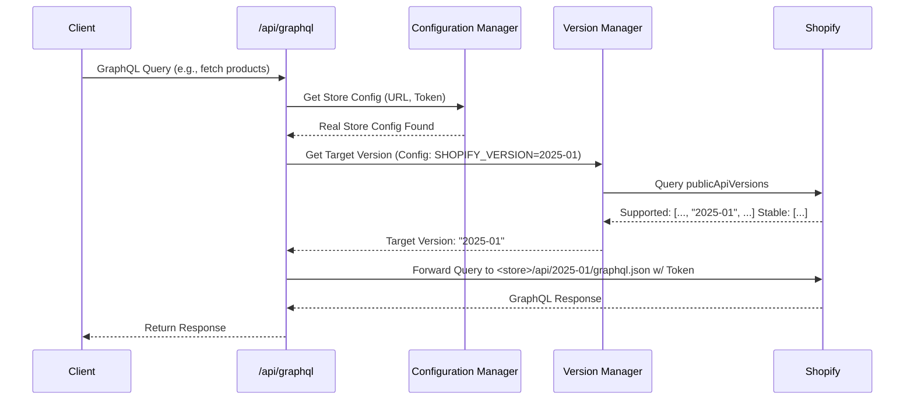
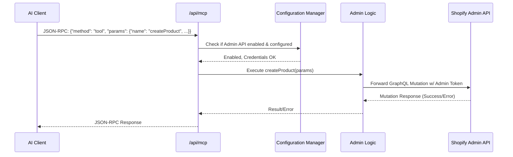
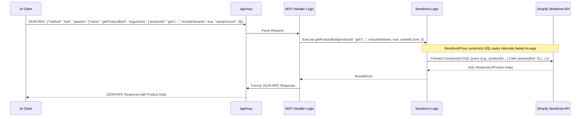

# ShopifyMCPMockShop Architecture v2.0

**Version:** 2.1
**Date:** 2025-04-03
**Authors:** Roo (AI Architect)

## 1. Introduction & Overview

This document details the architecture for the **ShopifyMCPMockShop**, a hosted service deployed on Vercel (`ShopifyMCP.vercel.app`). Its primary purpose is to act as an intelligent bridge between AI-based development tools/clients and Shopify's APIs (Storefront and optionally Admin), leveraging the Model Context Protocol (MCP) for interaction.

The system provides three core capabilities:

1.  **Shopify Storefront GraphQL Proxy:** Facilitates communication with the Shopify Storefront API. It intelligently routes requests to either `mock.shop` (default/fallback) or a user-configured real Shopify store, respecting specified API versions.
2.  **Optional Shopify Admin GraphQL Proxy:** Provides access to the Shopify Admin API if explicitly configured by the user with necessary credentials. This enables more advanced, potentially destructive operations.
3.  **Model Context Protocol (MCP) Interface:** Exposes a JSON-RPC endpoint allowing AI clients to discover capabilities (prompts, resources, tools) and interact with the Shopify environment in a structured way.

## 2. Goals & Architectural Drivers

The architecture is designed to meet the following key goals derived from the Product Requirements Document (`Requirements.md`):

*   **Flexibility:** Support both `mock.shop` for safe testing/development and real Shopify stores for production use cases.
*   **Version Control:** Allow selection and validation of specific Shopify API versions (Storefront & Admin), defaulting to the latest stable version if unspecified or invalid. Leverage `publicApiVersions` for discovery.
*   **Extensibility:** Provide a clear mechanism (MCP) for adding new capabilities (tools, prompts) over time.
*   **Security:** Implement robust security measures, especially for the optional Admin API which handles sensitive operations and credentials.
*   **Maintainability:** Ensure a clear separation of concerns between Storefront, Admin, and MCP logic.
*   **Developer Experience:** Offer a stable, self-documenting interface (MCP) for AI clients and developers.
*   **Scalability & Reliability:** Leverage Vercel's serverless infrastructure for efficient scaling and high availability.
*   **Safety & Transparency:** Utilize MCP `ToolAnnotations` (`readonly`, `destructive`, `idempotent`) to clearly communicate the nature and potential impact of each tool to clients.
## 3. System Architecture Diagram

```mermaid
graph TD
    subgraph "External Clients"
        A[AI Clients / Dev Tools]
    end

    subgraph "ShopifyMCPMockShop Service (Vercel @ ShopifyMCP.vercel.app)"
        direction LR
        subgraph "API Endpoints"
            B[MCP Endpoint<br>/api/mcp<br>(JSON-RPC)]
            C[Storefront Proxy<br>/api/graphql<br>(GraphQL)]
            D[Admin Proxy (Optional)<br>/api/adminGraphql<br>(GraphQL)]
        end
        subgraph "Core Logic"
            E[MCP Handler]
            F[Storefront Logic]
            G[Admin Logic (Optional)]
            H[Version Manager]
            I[Configuration Manager]
            J[Schema Manager]
        end
        subgraph "Data/State"
            K[Schema Cache<br>(schema.graphql, schema-admin.graphql)]
            L[Configuration<br>(Env Vars)]
        end
    end

    subgraph "External Dependencies"
        M[Shopify Storefront API<br>(Real Store or mock.shop)]
        N[Shopify Admin API<br>(Real Store Only)]
    end

    %% Connections
    A -- "JSON-RPC (MCP)" --> B
    A -- "GraphQL (Storefront)" --> C
    A -- "GraphQL (Admin)" --> D

    B --> E; E --> J; E --> H; E --> I; E --> F; E --> G;
    C --> F; F --> H; F --> I; F --> J;
    D --> G; G --> H; G --> I; G --> J;

    I --> L; J --> K;

    F --> M; G --> N;
    H -- "Query publicApiVersions" --> M;
    H -- "Query publicApiVersions (Admin)" --> N;
    J -- "Introspection" --> M;
    J -- "Introspection (Admin)" --> N;

    style B fill:#ccf,stroke:#333,stroke-width:2px
    style C fill:#cfc,stroke:#333,stroke-width:2px
    style D fill:#fcc,stroke:#333,stroke-width:2px
```

**Key Components:**

*   **API Endpoints:** Public-facing interfaces on Vercel.
*   **Core Logic:** Internal modules handling business logic, routing, and orchestration.
*   **Data/State:** Managed configuration and cached schemas.
*   **External Dependencies:** Shopify APIs.

## 4. Component Breakdown

### 4.1. Configuration Manager

*   **Responsibility:** Securely loads and provides access to configuration settings, primarily from Vercel environment variables (e.g., `SHOPIFY_STORE`, `SHOPIFY_ACCESS_TOKEN`, `SHOPIFY_VERSION`, `USE_ADMIN_API`, `ADMIN_ACCESS_TOKEN`, `ADMIN_VERSION`).
*   **Key Logic:** Validates presence and basic format of required variables based on context (e.g., Admin token needed only if `USE_ADMIN_API=1`). Provides default values (e.g., fallback to `mock.shop` if store credentials are missing).

### 4.2. Version Manager

*   **Responsibility:** Determines the correct Shopify API version to use for Storefront and Admin requests based on configuration and Shopify's reported capabilities.
*   **Key Logic:**
    1.  Reads the desired version from configuration (`SHOPIFY_VERSION`, `ADMIN_VERSION`).
    2.  Queries the relevant Shopify endpoint (`publicApiVersions` field) to get the list of supported and stable versions.
    3.  Validates the configured version against the supported list.
    4.  If the configured version is valid and supported, use it.
    5.  If configured version is invalid/unsupported, or no version is configured, default to the latest **stable** version reported by `publicApiVersions`.
    6.  Caches `publicApiVersions` results for a short duration (e.g., 5 minutes) to reduce redundant calls.

### 4.3. Schema Manager

*   **Responsibility:** Obtains and caches the GraphQL schemas (`schema.graphql`, `schema-admin.graphql`) for the target Shopify APIs (Storefront and Admin, based on configuration and selected version).
*   **Key Logic:**
    1.  Checks for the existence of the cached schema file (e.g., `schema.graphql`).
    2.  **If the file is missing (or deemed stale):**
        *   Determines the target API endpoint URL and version using the Configuration and Version Managers.
        *   Executes a standard GraphQL introspection query against the target endpoint via the appropriate proxy.
        *   Receives the JSON introspection result.
        *   Uses the `graphql` library (`buildClientSchema`, `printSchema`) to convert the JSON result into the standard GraphQL Schema Definition Language (SDL) format.
        *   Saves this SDL content to the corresponding local file (`schema.graphql` or `schema-admin.graphql`).
    3.  Reads the schema content (SDL) from the local file.
    4.  Provides access to the cached schema content (SDL) for use by MCP tools/resources (e.g., for query validation).
    5.  **Note:** This dynamic, on-demand introspection avoids handling large, pre-downloaded JSON introspection files directly. The system works primarily with the generated `.graphql` SDL files.

### 4.4. Storefront GraphQL Proxy (`/api/graphql`)

*   **Responsibility:** Securely proxy GraphQL requests to the appropriate Shopify Storefront API endpoint.
*   **Technology:** Vercel Serverless Function.
*   **Key Logic:**
    1.  Receives incoming GraphQL requests.
    2.  Uses Configuration Manager to determine if real store credentials are provided.
    3.  If yes, uses Version Manager to determine the target version and constructs the real store's GraphQL endpoint URL (e.g., `https://<shop>.myshopify.com/api/<version>/graphql.json`). Forwards the request with the `X-Shopify-Storefront-Access-Token`.
    4.  If no, constructs the `mock.shop` GraphQL endpoint URL. Forwards the request.
    5.  Handles responses, including error mapping (see Error Handling).
    6.  Implements basic security checks (e.g., rate limiting, input validation).

### 4.5. Admin GraphQL Proxy (`/api/adminGraphql`)

*   **Responsibility:** Securely proxy GraphQL requests to the Shopify Admin API. **This endpoint is only active if `USE_ADMIN_API=1` and valid Admin credentials are configured.**
*   **Technology:** Vercel Serverless Function.
*   **Key Logic:**
    1.  Checks Configuration Manager: If Admin API is not enabled or credentials are missing, returns an appropriate error immediately.
    2.  Uses Version Manager to determine the target Admin API version.
    3.  Constructs the Admin API endpoint URL (e.g., `https://<shop>.myshopify.com/admin/api/<version>/graphql.json`).
    4.  Forwards the GraphQL request, including the `X-Shopify-Access-Token` (Admin token).
    5.  Implements stricter security: Validates token format, potentially logs access (see Security).
    6.  Handles responses and error mapping.

### 4.6. MCP Endpoint (`/api/mcp`)

*   **Responsibility:** Implements the Model Context Protocol via JSON-RPC. Acts as the primary interface for AI clients.
*   **Technology:** Vercel Serverless Function.
*   **Key Logic:**
    1.  Parses incoming JSON-RPC requests.
    2.  Handles standard MCP methods (`initialize`, `prompts`, `resources`, `tools`).
    3.  **`initialize`:** Returns capabilities based on configuration (e.g., Admin tools only listed if Admin API is enabled). Includes resolved Storefront/Admin versions.
    4.  **`prompts`, `resources`, `tools`:** Loads definitions (potentially from static files or generated based on schemas). The `tools` definitions will include **`ToolAnnotations`** (`readonly`, `destructive`, `idempotent`) to describe their behavior.
    5.  **Tool Execution:** When a tool is invoked:
        *   Determines if it requires Storefront or Admin API access based on the specific tool invoked.
        *   **Executes specific server-side logic for the tool**, constructing the necessary GraphQL query/mutation based on validated arguments. (Avoids passing raw client GQL for Admin tools).
        *   Calls the appropriate internal proxy logic (Storefront or Admin).
        *   Uses Schema Manager to potentially validate tool inputs/outputs against the schema.
        *   Formats the result according to JSON-RPC response structure.
    6.  Handles JSON-RPC specific errors.

## 5. Data Flow Examples

### 5.1. Storefront Query (Version Specified)



### 5.2. MCP Admin Tool Execution



## 6. Deployment Architecture (Vercel)

### 5.3. MCP Parameterized Tool Execution (Example: getProductById)



## 6. Deployment Architecture (Vercel)

*   **Platform:** Vercel
*   **Structure:** Next.js application.
*   **Serverless Functions:**
    *   `/api/mcp`: Handles MCP JSON-RPC requests.
    *   `/api/graphql`: Handles Storefront GraphQL proxying.
    *   `/api/adminGraphql`: Handles Admin GraphQL proxying (conditionally active).
*   **Configuration:** Managed via Vercel Environment Variables (scoped appropriately, e.g., Admin tokens marked as sensitive).
*   **Build Process:** Includes steps for potentially running initial schema introspection (for defaults/mock.shop) and packaging schemas.
*   **Logging & Monitoring:** Utilize Vercel's built-in logging and analytics. Consider integrating a dedicated monitoring service for more detailed insights, especially for error tracking.

```mermaid
graph TD
    subgraph "Vercel Platform"
        direction LR
        A[Next.js Frontend/App] --> B{Request Routing};
        B -- "/api/mcp" --> C[MCP Serverless Fn];
        B -- "/api/graphql" --> D[Storefront Serverless Fn];
        B -- "/api/adminGraphql" --> E[Admin Serverless Fn (Conditional)];
        F[Vercel Build Step] --> G[Schema Introspection Script];
        G --> H[Cached Schemas];
        I[Vercel Environment Variables] --> C; I --> D; I --> E;
        J[Vercel Logging/Analytics] --> C; J --> D; J --> E;
    end
    C --> K[Core Logic Modules]; D --> K; E --> K;
    H --> K;
```

## 7. Non-Functional Requirements (NFRs) Strategy

*   **Security:**
    *   **HTTPS:** Enforced by Vercel.
    *   **Authentication:** Storefront and Admin tokens handled securely via environment variables, never exposed client-side. Admin token usage strictly gated by `USE_ADMIN_API` flag.
    *   **Authorization:** Implicitly handled by Shopify based on the provided token's scope. No separate authorization layer within the service itself.
    *   **Input Validation:** Basic validation on API endpoints (GraphQL query structure, JSON-RPC format). Deeper validation within MCP tools based on schemas and specific tool logic.
    *   **Tool Annotations:** Provide `ToolAnnotations` (`readonly`, `destructive`, `idempotent`) for each tool via the MCP `tools` method, enabling clients to make informed decisions about execution.
    *   **Rate Limiting:** Leverage Vercel's built-in protection. Consider application-level limiting if specific abuse patterns emerge.
    *   **Audit Logging:** Log key events, especially Admin API calls (timestamp, tool name, success/failure). Sensitive data (like full queries/responses) should be omitted or masked in logs.
*   **Scalability & Reliability:**
    *   Leverage Vercel's auto-scaling serverless functions.
    *   Separation of concerns into distinct functions (`/api/mcp`, `/api/graphql`, `/api/adminGraphql`) allows independent scaling.
    *   Stateless design where possible; state managed via configuration or short-lived caches.
    *   Reliability depends heavily on Shopify API uptime. Implement appropriate retry logic for transient network issues if necessary (use with caution for mutations).
*   **Maintainability:**
    *   Modular codebase with clear separation for MCP, Storefront, Admin, Versioning, Schema, and Config logic.
    *   Use TypeScript for type safety.
    *   Store schemas separately (`schema.graphql`, `schema-admin.graphql`).
    *   Unit and integration tests for core logic modules and API endpoints.
*   **Performance:**
    *   Minimize overhead in proxy layers.
    *   Cache `publicApiVersions` results.
    *   Cache introspected schemas. Consider build-time introspection for defaults.
    *   Leverage Vercel's edge network for reduced latency.

## 8. Error Handling

*   **Strategy:** Centralized error handling within each API endpoint function.
*   **Standard Format:** Map internal errors and Shopify API errors to consistent response formats (JSON-RPC error objects for `/api/mcp`, standard GraphQL error format for `/api/graphql` and `/api/adminGraphql`).
*   **Logging:** Log detailed error information (stack trace, request context - masking sensitive data) for debugging via Vercel logs or integrated monitoring.
*   **Client Errors:** Return clear error messages for invalid requests, authentication failures, or version mismatches.
*   **Server/Dependency Errors:** Return generic server error messages to the client while logging specifics internally.

## 9. Future Considerations

*   Persistent schema caching (e.g., Vercel KV Store) if introspection becomes a performance bottleneck.
*   More sophisticated rate limiting or security rules (e.g., using Vercel Firewall).
*   Webhooks from Shopify to trigger schema updates automatically.
*   Support for multiple real stores simultaneously (would require significant changes to configuration and routing).

*   **Admin Tool Expansion:** Implementing a comprehensive suite of granular Admin API tools, each with appropriate `ToolAnnotations`, to cover common administrative tasks safely.
*   **Enhanced Query Flexibility:** Exploring ways to handle a broader range of less common user requests safely, potentially through more flexible filtering/sorting in existing tools or carefully designed new tools (avoiding raw GQL execution tools for Admin API).
*   Exploring server-side NL-to-GQL generation (potentially using user-provided API keys) as a more advanced feature, ensuring generated queries align with tool capabilities and safety constraints.
This revised architecture provides a more detailed, production-oriented blueprint for the ShopifyMCPMockShop service, directly addressing the requirements and incorporating best practices for security, scalability, and maintainability.
